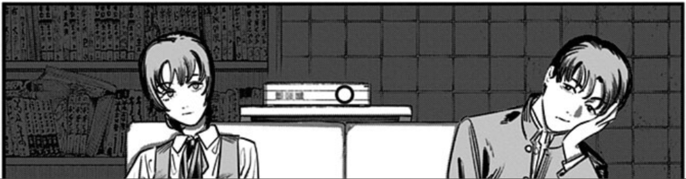

#Sobre el sitio web y yo

Hola amig@ 🤖 mi nombre es Mau y me encuentro estudiando informática. El objetivo de este sitio es poner en práctica lo que aprendo sobre desarrollo web y al mismo tiempo compartir recursos que me han ayudado con el aprendizaje del idioma japonés.

En este apartado escribiré el nombre de las películas, series, anime, manga y novelas ligeras que he usado en el proceso de adquisición del idioma japonés. Todo esto lo hago con el único fin de ver que tanto he progresado y para ayudarme a mantener la motivación.

##Contenido que he usado para inmersión

### Películas
* 銀の匙
* 旅猫リポート
* 君の膵臓をたべたい
* オレンジ
* 街の上で
* 恋空
* 彼女が好きなものは ホモであって僕ではない
* アイアムアヒーロー
* ちひろさん
* 君に届け
* ビリギャル
* ゾンビになるまでにしたい100のこと
* パーフェクトブル
* シン・仮面ライダー
* シン・ウルトラマン
* タンポポ
* 怪物
* バトル・ロワイアル
### Series
* コタローは一人暮らし
* 初恋
* GTO (1998)
* 池袋ウエストゲートパーク
* 木更津キャッツアイ
* 彼女、お借りします
* 不適切にもほどがある！
* Tiger & Dragon
### Anime
* イジらないで、長瀞さん (S1)
* スキップとローファー (S1)
* ゾンビになるまでにしたい100のこと (S1)
* ゆびさきと恋々 (S1)
* Ping Pong the Animation
* 葬送のフリーレン (S1)
### Manga
* さよなら絵梨
* ルックバック
* サンダー3 (V1-V5)
* オレンジ (V1-V5)
* 町田君の世界 (V1-V4)
* GIGANT (V1-V2)
  
