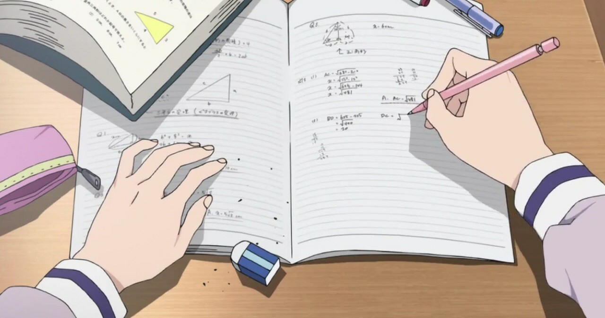
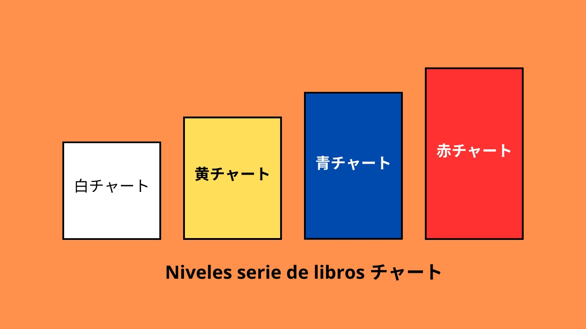

# Matemáticas
Dada la ausencia de un temario oficial, creo que la estrategia más efectiva para prepararse para este examen radica en practicar con exámenes anteriores, aprovechar los cursos disponibles en YouTube y estudiar con los libros de matemáticas que un estudiante japonés de preparatoria utilizaría para sus exámenes de ingreso a la universidad. No puedo adjudicarme la originalidad de esta idea; la descubrí en una publicación de Reddit y la comparto aquí debido a que, al menos en mi caso, ha resultado eficaz.

Antes de empezar con la lista, me gustaría profundizar en cómo se clasifican las matemáticas en Japón y cuál es la serie de libros más utilizada por los estudiantes japoneses.
## | Clasificación de las matemáticas en Japón |
Según lo que pude investigar las matemáticas en Japón se clasifican en las siguientes categorías:

* 数Ⅰ
* 数Ⅱ
* 数Ⅲ 
* 数A 
* 数B
* 数C
  
Y generalmente se imparten en el siguiente orden:

* I y A en el primer año de preparatoria
* II y B en el segundo
* III en la segunda mitad del segundo año, especialmente para los cursos de ciencias.

Ahora, seguramente te estás preguntando: ¿Para qué me sirve saber esto? Bueno, la respuesta es simple. Esto nos sirve para tener una idea de cuáles son los temas que debemos estudiar para el examen de matemáticas de la beca MEXT.

## | Temario Beca MEXT |

### Temario NO oficial creado por la comunidad
El siguiente temario yo lo encontré en una publicación de Reddit y lo comparto aquí para darle crédito a su creador y para que tengas una idea de los temas que debes estudiar para el examen de matemáticas de la beca MEXT.

* [Temario](..assets/files/Detailed_MEXT_Undergrad_Syllabus.pdf){:target="_blank"} - Click para descargar el temario en PDF

### Temario del sistema educativo de Japón  (Esta sección se encuentra en construcción)
Encontré un temario del sistema educativo de Japón, en el que se describe el contenido de cada tipo de matemáticas que vimos en la clasificación anterior. A continuación, escribiré cada tema utilizando su término en japonés, junto con su respectiva traducción. De esta manera, si deseas profundizar en alguno de ellos, podrás copiar el término y pegarlo directamente en Google para consultar fuentes japonesas. Además, al buscar estos temas en YouTube, podrás encontrar ejercicios del tipo que encontrarías si estuvieras estudiando en Japón.

### | 数Ⅰ |
* 数と式
* 図形と計量
* 二次関数
* データの分析

### | 数Ⅱ |
* いろいろな式
* 図形と方程式
* 指数関数・対数関数
* 三角関数
* 微分・積分の考え

### | 数Ⅲ |
* 平面上の曲線と複素数平面
* 極限
* 微分法
* 積分法

### | 数A |
* 場合の数と確率
* 整数の性質
* 図形の性質

### | 数B |
* 確率分布と統計的な推測
* 数列
* ベクトル

### | 数C |
* ベクトル
* 平面上の曲線と複素数平面
* 数学的な表現の工夫 

## | Libros beca MEXT |
### Serie de libros チャート (Chart)

### Niveles

### ¿Cómo puedo usarlos si no sé japonés?

### ¿Dónde puedo conseguirlos?
Al ser unos libros utilizados por los estudiantes japoneses, es necesario adquirirlos allí. Para ello, podemos usar Amazon Japón. A continuación, adjuntaré los enlaces a Amazon Japan y los links de los libros que yo utilicé

* [新課程 チャート式解法と演習数学I+A](https://www.amazon.co.jp/-/en/%E3%83%81%E3%83%A3%E3%83%BC%E3%83%88%E7%A0%94%E7%A9%B6%E6%89%80/dp/4410107178/ref=sr_1_12?crid=GCXE28OLC2KS&keywords=%E3%83%81%E3%83%A3%E3%83%BC%E3%83%88&qid=1692036684&s=specialty-aps&sprefix=%E3%83%81%E3%83%A3%E3%83%BC%E3%83%88%2Cspecialty-aps%2C301&sr=8-12&srs=3534638051){:target="_blank"} - Este libro contiene los temas de 数Ⅰ y 数A y su nivel de dificultad es el color amarillo.
* [※ 新課程 チャート式基礎からの数学I+A](https://www.amazon.co.jp/-/en/%E3%83%81%E3%83%A3%E3%83%BC%E3%83%88%E7%A0%94%E7%A9%B6%E6%89%80/dp/4410105787/ref=pd_bxgy_sccl_2/356-2036877-2134425?pd_rd_w=XJfJy&content-id=amzn1.sym.bc57a5ab-9f02-4944-8c5c-9e1696e0d32c&pf_rd_p=bc57a5ab-9f02-4944-8c5c-9e1696e0d32c&pf_rd_r=QKMK1EXCG642RMNPYFHS&pd_rd_wg=tutA9&pd_rd_r=01cbd1ea-d224-4ed9-8344-6864c642a157&pd_rd_i=4410105787&psc=1){:target="_blank"} - Este libro contiene los temas de 数Ⅰ y 数A y su nivel de dificultad es el color azul. Ambos libros abarcan los mismos temas, pero recomiendo este libro porque la dificultad es mayor y considero que es mejor resolver ejercicios más difíciles para prepararse para el examen.
### Canales de YouTube

* [※ The Organic Chemistry Tutor](https://www.youtube.com/c/TheOrganicChemistryTutor){:target="_blank"} - Este canal contiene una gran variedad de videos sobre matemáticas, física y química.
* [khan academy](https://www.youtube.com/@khanacademy){:target="_blank"} 
* [Julio Profe](https://www.youtube.com/@julioprofe){:target="_blank"} - Un clásico.
* [Matemáticas profe Alex](https://www.youtube.com/@MatematicasprofeAlex){:target="_blank"}

### Examenes de años anteriores
Algunos de los examenes de años anteriores se encuentran disponibles en la página oficial de study in Japan en el siguiente [enlace](https://www.studyinjapan.go.jp/en/planning/scholarship/application/examination/){:target="_blank"}.